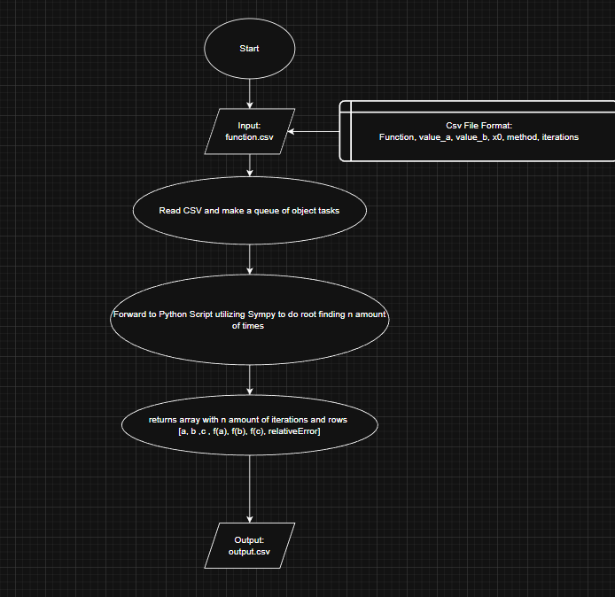
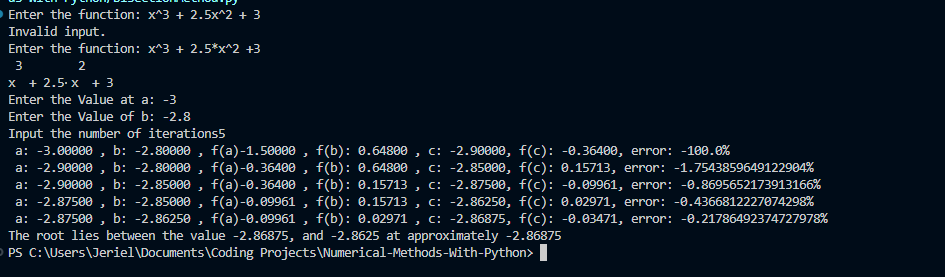
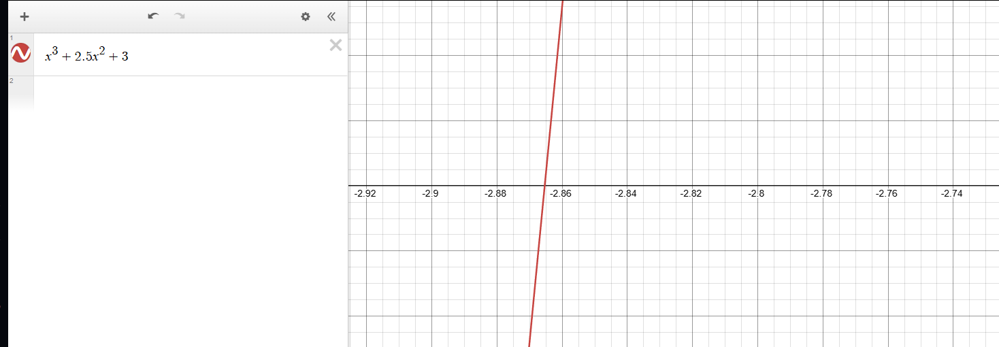

# Project Name: Iterative Root Finding Methods

## Description:
Using C++ as the file and database management system and Python as the main processing language by utilizing Sympy this program visualizes the flow of iterative root finding methods.

The goal of this program is to break down the iterative process by displaying the values for a, values for b, and if the function is an open bracket method a value for x0 will be passed. the iterative process will be repeated n amount of times specified in the csv file. 

The project will utilize a csv file since it can easily be converted and used as an excel file (.xlsx) to graph the relative error and analyze the method chosen for the formula. 

## Program Flow Diagram

### CLI Sample Python Process
input:
Function:x^3 + 2x5 * x^2 +3,
value at a= -3  
value at b =-2.8 
iterations 5
output:

Expected Output: 

